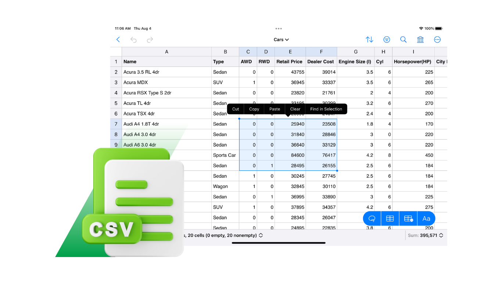

# DataNest - Data, Made Easy

Effortlessly manage your CSV files online with DataNest. Upload, edit, and export CSVs – all in your browser, no sign-up required.

---

## 🚀 Features

- ✅ **Drag & Drop CSV Upload**
- ✅ **In-Browser Table Editing**
- ✅ **Export Edited Files**
- ✅ **Real-Time Data Updates**
- ✅ **Clean, Responsive UI**
- ✅ **No Login or Signup Required**

---

## 🖼️ Demo

🔗 [Live App](https://datanest-works.vercel.app)

---
## 🛠️ Tech Stack

- **Frontend**: HTML, CSS, JavaScript, Vite + React, EmailJs
- **Deployment**: [Vercel](https://vercel.com)

---
## 📦 Getting Started (Local Setup)

1. **Clone the repository**:
   ```bash
   git clone https://github.com/PRAVEENKUMAR-V0811/DataNest-Online-CSV-Editor.git

2. **Navigate to the project folder**: 
    ```bash
    cd DataNest-Online-CSV-Editor/frontend

3. **Install Dependencies**:
    ```bash
    npm install

4. **Run Project**:
    ``bash
    npm run dev

---

## 📸 Screenshots
-----------------------------------------
| Upload CSV | Edit Table | Export File |
|------------|------------|-------------|
|  |  |  |
-----------------------------------------

---

## 🚧 Future Enhancements
- ✉️ In-Mail Feature – Send CSVs directly via email.

- 🌙 Dark Mode Toggle – Improve user experience in low-light environments.

- 🤝 Real-Time Collaboration – Allow multiple users to edit the same file.

- 📂 Support for Large CSV Files – Handle large datasets with better performance.

- 📤 Export in Various File Formats – CSV, Excel, JSON, and more.

---

## 🙌 Contributing
**Contributions are welcome! Feel free to fork this repo and submit a pull request.**

- Fork the project

- Clone your fork

- Create a new branch

- Make your changes

- Submit a Pull Request

---

## 👤 Author
**Praveen Kumar V**
[Mail ID](mailto:praveenkumarv0811@gmail.com)
[Portfolio](https://buildwithpraveen.vercel.app) | [LinkedIn](https://www.linkedin.com/in/praveenkumar-v08/)
